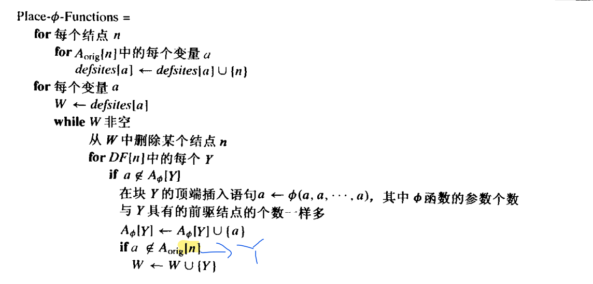
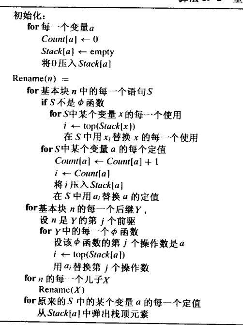

# 实验四：SSA

## 实验介绍

**SSA**（static single-assignmet：每个变量只有一次**def**。但这个def可以出现在循环中，所以是静态的。

SSA作用：

1. 有利于做数据流分析和代码优化
2. **def-use**链大小是N*M，如果是SSA，则是N+M的。**def-use**链是一个能够高校获得信息的结构，对它的一种改进是**SSA**形式。
3. 简化冲突图构造
4. 重要的是LLVM是要求SSA形式，将代码转成SSA，LLVM才能运行

当两条控制流汇合到一起时，若都定义了变量a，如何选择成为问题。这里通过引入**phi function**来解决。

它“知道“该如何选择。

具体有两种策略：

- 通过MOVE来实现**phi function**
- 不需要实现，仅仅用作分析

在LLVM，**phi function**的写法如下

```text
<result> = phi <ty> [ <val0>, <label0>], ...
```

核心就在如何**插入phi function**，然后**变量重命名**

有两种标准：

1. 路径汇合标准

2. 必经节点边界标准：只有节点x包含某个变量a的def，则x的必经节点边界的任何节点z都需要一个a的

   phi 函数

该部分都有伪代码，思路非常清晰，主要问题是实现细节要注意。

## 实验流程

在Lab4中，我们将标量放入内存中，实现了一种伪的SSA，这里我们要做的是将标量放入寄存器中实现真正的SSA。

有三条实现路径：-

- 徐辉老师上课讲的基于数据流分析的方法，简单高效，但插phi的位置不够优。

- 直接从内存形式，做SSA，这是clang+LLVM的标准做法。
- 将标量放入寄存器中，然后进行经典SSA流程。

这里我们采用第三条，大家可以参考虎书第十八章和第十九章，上面对SSA的讲解非常详细，**甚至有伪代码。**

### mem2reg

首先，我们要找到所有分配在栈上的标量 ，通过判断`alloca`+`len==0`判断。

然后删除该指针所关联的` alloca`，`store`，`load`指令，并记录向该地址存取的标量。

最后将所有的标量名字替换成一个。

注意，这里有以下几点需要思考：

- `store`所有情况直接删除可以吗？考虑常量
- 一个标量可能同多个地址相关，问题可以转化同上，`store`所有情况直接删除可以吗？
- `alloca`可以直接删除吗？这里是完全没问题的，但后面有一些坑，需要在这里处理。

如果这里经过思考后，还无法解决，直接在群里面提问，助教会答疑。这里没有标准做法，只是鼓励大家探索不同的实现思路。

---

~~想到大家不愿意思考~~
这里提供一个简单的策略：

将所有的`alloca`都转成一条`move`指令

将所有的`store`都转成一条`move`指令

至于`load`指令，如果你的store将所为情况都处理了，可以直接删掉

但是这样做，会生成很多冗余指令，思考更优的mem2reg策略。或者如何进行优化，删除冗余指令。


代码示例：

```c
...
int a;
while(1){
    a=b+c;
    ...
}
putint(a);
...
```

```c
...
int a,b;
b=getint();
while(b){
    a=b+c;
    ...
}
putint(a);
...
```


### 不可达代码删除

SSA的要求是起始节点必须唯一，这里直接从src节点遍历图，然后删除未着色的节点即可。

### 活跃分析

这里我们需要以 `block`为单位，对**temp**进行活跃分析。这里采用迭代的方式计算，直到集合不发生变化。

在后续实验中，我们还需要以指令为单位，进行活跃分析。

$$
in[n]=use[n]\bigcup  (out[n]-def[n])
$$

$$
out[n]=\bigcup in[s]  (s \in succ[n])
$$

注意一个`block` def和use集合，并不简单是所有指令def和use集合的并集。

### 支配节点

算法如下，通过迭代求解，复杂度是O(N^3)。注意初始时除了`s0`，每个集合必须包含图中的所有节点。

D[n]是n的所有必经节点的集合
$$
D[s_0]={s_0} \\
D[n]=\{n\}\bigcup\{\cap D[p]\}  (p \in pred[n])
$$

### 支配树

支配树是每个节点的和其直接必经节点形成的树。直接必经节点**idom**性质如下：

>(1)idom(n)和n不是同一个结点
>(2) idom(n)是n的必经结点
>(3) idom(n)不是 n的其他必经结点的必经结点。
>
>除s0外，所有其他结点至少有一个除自己本身之外的必经结点 (因为s0是每个结点的必经结点)，因此，除s0外，所有其他结点都恰好有一个直接必经结点

实现时，找到每个节点的所有必经节点，然后根据这三条性质判断即可。

### 支配边界

DF_local[n]:{n的一些后继组成的集合，这些后继的直接必经节点不是n}

DF_up[n]:{属于n的必经节点边界，但不以n的直接必经节点为严格必经节点的节点}
$$
DF[n]=DF_{local}[n]\cup(\bigcup DF_{up}[c]) (c \in children[n])
$$
伪代码如下

```
computeDF[n]=
    S={}
    for succ[n]中的每一个个结点y		这个循环计算DF_local[n]
    	if idom(y)≠n
    		S=SU{y}
    for必经结点树中的n 的每个儿子c
    	computeDF[c]
    	for DF[c]中的每个元素
    		if n不是w的必经结点，或者if n==w
    			S=SU{w}
    DF[n]=S
```

### 插Phi

A_orig[n]是在节点n def的变量集合。

注意图中的修改，虎书上有误。

注意这里我们只对在该节点live in的变量进行插phi。

如果变量在某个前驱没有live out，那我们还要插phi吗？

需要。这里就回到前面对alloca的处理，我们对每个alloca，都要将其转化成一个初始化的语句，初始化为0，虽然该0值永远不会被用到，这里冗余的指令，开销很小，在LLVM上加入优化，以及f翻译成机器指令后，完全可以消掉。如果同学们还有更好的处理，欢迎探讨。




### 重命名



## 辅助函数

### graph.cpp

这是一个C++版本的图，如果使用我的代码，会用到。~~（其实没那么好用）~~
建议大家优先直接使用成员，而不是封装好的函数。~~（因为也没化简多少）~~
我这里留了一个小小的bug，赋值函数的问题。

### bg_llvm.cpp

对block创建图。

需完成`SingleSourceGraph`

### liveness.cpp

做数据流分析。需要完成liveness的计算。

同时处理一下def和use。这里基本是重复性的工作，不过可以有一些自己的trick。
### temp.cpp
添加了部分集合操作

## 改进

如果有同学感兴趣，并且有余力，可以尝试做一些优化，减少编译出来的代码运行时间。
此外也可以对编译器本身的算法做一些优化，比如Liveness和dominator的计算，不使用迭代的方式。

注意代码的执行效率，除了上面提到到算法，你自己使用的算法，最好是线性复杂度。

## 测试考察功能点

1. 对LLVM IR的了解

2. 支配节点计算

3. 支配边界计算

4. 插phi的理解

5. 掌握简单的数据流分析

本次实验仍是以测试为准，大家可以完全不用我给的代码和实现思路。

评分标准：

20个点public，一个3分。10个点private，一个4分。

但是注意本实验输出结果正确，并不代表真正正确，应该保证翻译后的LLVM代码，不会有标量在内存中。如果没有实现SSA，该点不得分。


